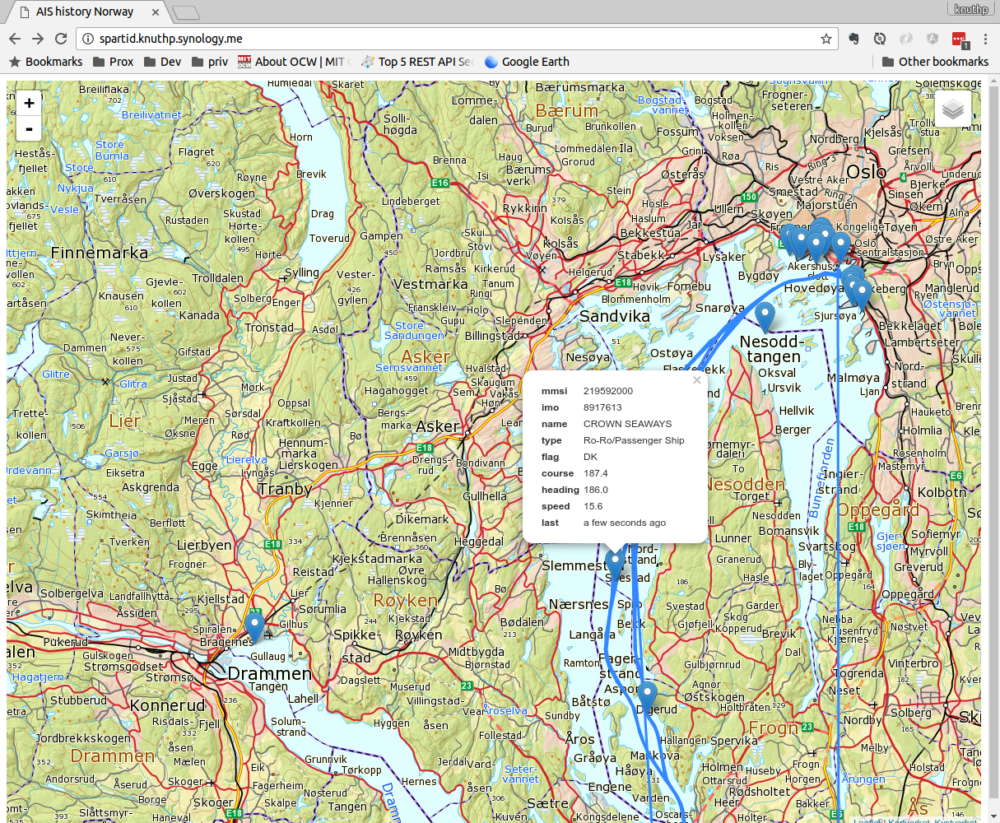

# Simple AIS example with data from Kystverket
[Norwegian Kystverket](http://kystverket.no) publish AIS data for ship positions that can be used under [NLOD license](https://data.norge.no/nlod/no/1.0). This application stores the positions received and present current situation and history in a Map using [Leaflet](http://http://leafletjs.com).

## Technology
This demo is made using Python with Flask for the web server part, Leaflet/HTML for the presentation and postgis for the database. AIS position data is read from a TCP connection continously using Python library [pyais](https://github.com/M0r13n/pyais). The position updates are stored in a postgis database using two tables: LastPositionReport and HistoricPosition. 

## Example


## Docker configuration
Docker compose is used for deploymnet

```
docker compose up -d --build
```
Web interface accessible on <http://localhost:9101>

### Configuration
The application can be configured by providing environment variables or a dotenv file called `.spartid-ais.env` in the root directory.

For available settings see:

[settings.py](./spartid_ais/settings.py)


Example `.spartid-ais.env`
```
MAP__ZOOM=16
MAP__CENTER__LONG=10.611268532369081
MAP__CENTER__LAT=59.669607206900906
```


## Backup
```bash
docker exec spartid-ais-db-1 pg_dump -U postgres spartid_ais | gzip > /srv/db-backups/posgtres/spartid_ais/spartid_ais-$(date +%Y-%m-%d).tar.gz
```